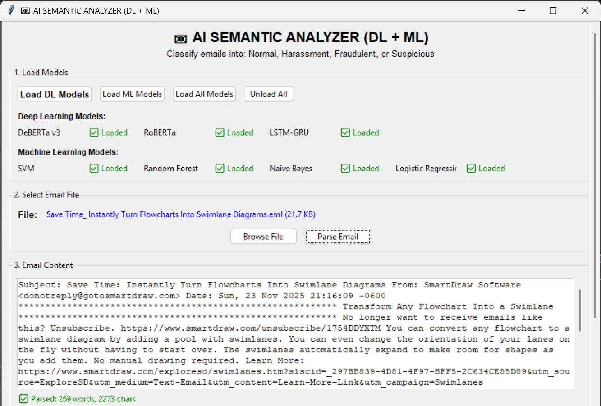

## 📧 SEMANTIC ANALYSIS – Machine Learning vs Deep Learning (Comparison Project)

This project compares how Machine Learning (ML) and Deep Learning (DL) models perform in classifying emails into different categories.
A simple GUI is provided to test both approaches and observe prediction differences in real time.

⸻

# 🎯 Goal

To evaluate and compare ML vs DL models based on:
	•	Accuracy & performance
	•	Understanding of email context
	•	Model behavior on real inputs
	•	Efficiency and prediction speed

⸻

# 🧠 Models Included

🔹 Deep Learning Models

Model	Type
deberta_email_model	Transformer-based
LSTM_GRU_email_model	Sequential hybrid model
Roberta_email_model	Contextual transformer

📥 Download DL models:
👉 https://drive.google.com/drive/folders/1rCOiVuvSnGBVY3qgWffXywZXWlV7HeE9?usp=sharing

⸻

🔹 Machine Learning Models

Model File	Description
logistic_regression.pkl	ML classifier
naive_bayes.pkl	Probabilistic classifier
random_forest.pkl	Ensemble model
svm.pkl	Support Vector Machine
tfidf_vectorizer.pkl	Text feature extractor
label_mapping.pkl	Label decoder

📥 Download ML models:
👉 https://drive.google.com/drive/folders/131vT0YRg2xqArE37aG9ixTraZmZvSsYx?usp=sharing
⸻

🏁 How to Run

pip install -r requirements.txt
python main.py.py

⸻

📊 Summary: ML vs DL

Aspect	ML Models	DL Models
Training speed	Fast	Slower
Hardware requirement	Low	Medium/High
Context understanding	Basic	Strong
Accuracy potential	Good	High
Suitable for	Small datasets	Complex real-world data

⸻

📸 GUI

## GUI Preview

